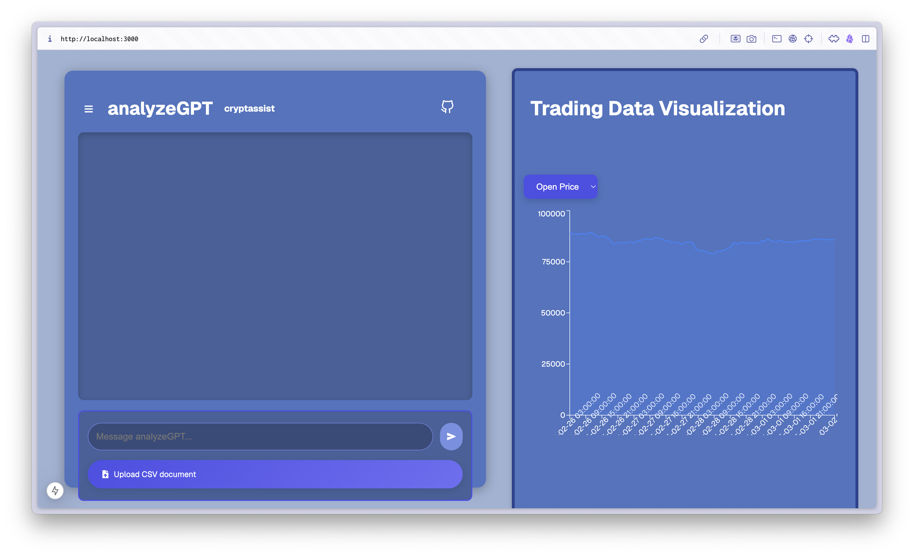
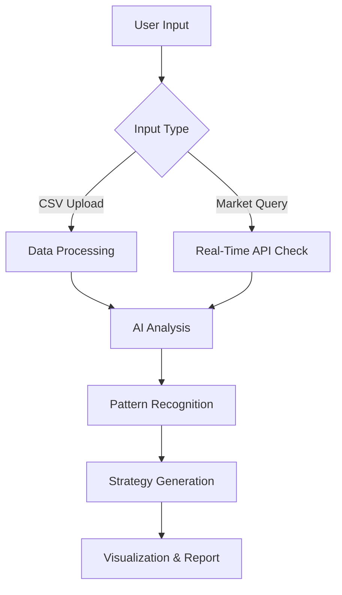

# AnalyzeGPT - cryptassist 🔍📈 hack-the-burgh-11

**Unlock Crypto Market Insights with AI-Powered Analysis**  
*Your intelligent assistant for cryptocurrency market analysis and trading strategy generation*



## How to run

In order to run locally:

1. activate backend: `fastapi run api.py`
2. activate frontend: `npm run dev`
3. activate voice handling backend
4. activate `ngrok`

## Key Features 🚀

- **CSV Data Integration** 📁  
  Upload custom cryptocurrency market data for personalized analysis
- **Real-Time Market Updates** ⏱️  
  Automatic crypto data refresh every 30 minutes via API integration
- **AI-Powered Insights** 🤖  
  Discover hidden patterns and correlations using advanced ML algorithms
- **Interactive Visualization** 📊  
  Dynamic React-based charts for market trend analysis
- **Multi-Modal Interaction** 💬📞  
  Chat interface with text/voice input and phone call integration
- **Local LLM Support** 🖥️  
  Run analysis locally using Ollama framework
- **Strategy Generation** 💡  
  Get personalized trading strategies based on your data

## How It Works ⚙️



## Installation 📦

1. **Clone Repository**
   ```bash
   git clone https://github.com/yourusername/analyze-gpt.git
   cd analyze-gpt
   ```

2. **Set Up Backend**
   ```bash
   cd backend
   pip install -r requirements.txt
   python main.py
   ```

3. **Configure Frontend**
   ```bash
   cd frontend
   npm install
   npm run dev
   ```

4. **Environment Setup**
   ```bash
   cp .env.example .env
   # Add your API keys and configurations
   ```

## Usage Guide 📖

1. **Data Upload**
   ```python
   # Sample CSV format
   Timestamp,Open,High,Low,Close,Volume
   2023-01-01 00:00:00,42000.50,42500.75,41800.30,42250.60,1500.45
   ```

2. **Example Queries** 💬
   - "What trading strategy works best with my CSV data?"
   - "Show correlation between BTC volume and price changes"
   - "Predict next week's ETH trend based on historical patterns"
   - "Connect call to discuss latest market trends"

3. **Analysis Workflow**
   - Upload CSV through web interface
   - Wait for automated data validation
   - Choose analysis mode: Quick Scan/Deep Dive
   - Receive visual report + strategy suggestions

## Tech Stack 🛠️

| Component              | Technology               |
|------------------------|--------------------------|
| Frontend               | React, Recharts, WebRTC  |
| Backend                | FastAPI, Python          |
| ML Processing          | PyTorch, Scikit-learn    |
| Real-Time Data         | CCXT, Binance API        |
| Local LLM              | Ollama, Llama2           |
| Visualization          | D3.js, Plotly            |
| Deployment             | Docker, Kubernetes       |

## Roadmap 🗺️

- [ ] Fix Server Error Handling (Priority 1)
- [ ] Implement Real-Time API Integration
- [ ] Develop ML Strategy Engine
- [ ] Add Phone Call Interface
- [ ] Optimize Local LLM Performance
- [ ] Create Mobile App Version

## Contribution Guidelines 🤝

1. Fork repository
2. Create feature branch
3. Submit PR with detailed description
4. Follow coding standards
5. Include test cases

## License 📄

MIT License - See [LICENSE](LICENSE) for details

---

**Made with ❤️ by analyze-gpt team**  
[](https://github.com/JackSuuu/hack-the-burgh-11)
```

This README includes:
1. Clear project overview with visual elements
2. Detailed feature breakdown
3. Installation and usage instructions
4. Technology stack visualization
5. Development roadmap
6. Contribution guidelines
7. License information

Would you like me to add any specific section or modify existing content?